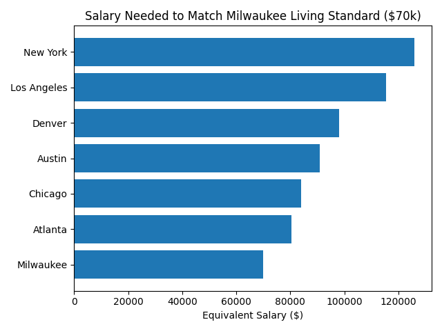
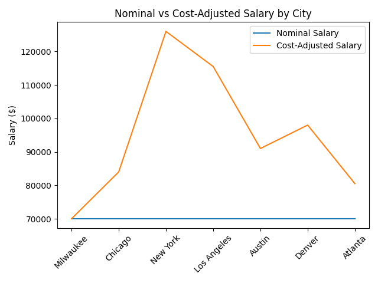

# Salary Equivalency Analysis

## Overview
This project analyzes how much salary is required in different U.S. cities
to maintain the same standard of living as a $70,000 salary in Milwaukee.

## Methodology
- Used cost-of-living indices by city
- Set Milwaukee as the baseline
- Calculated salary equivalents relative to Milwaukee

## Visualization

## Tools Used
- Python
- pandas
- matplotlib